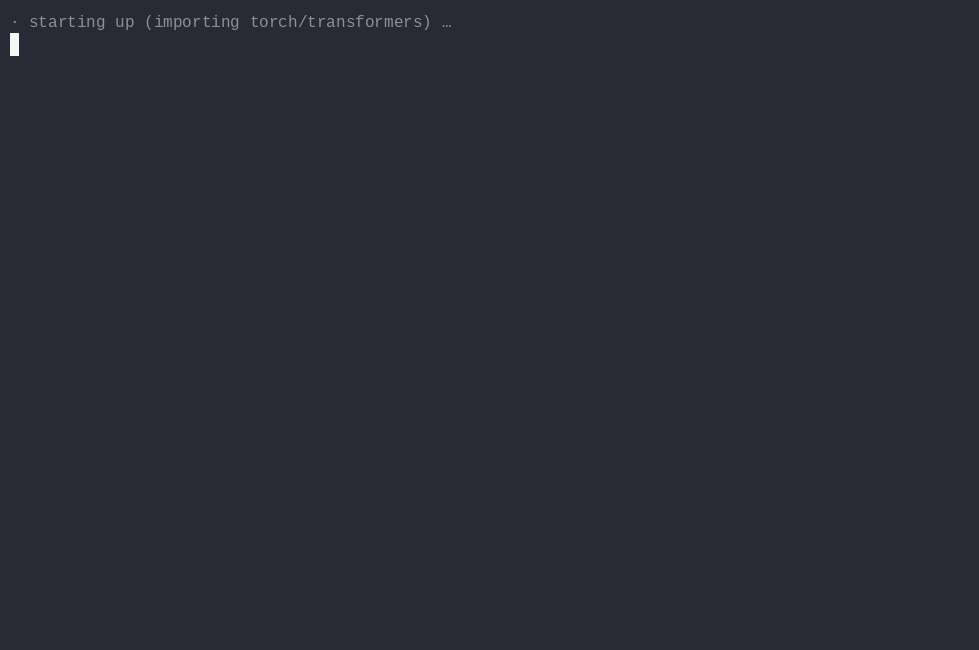

# Exact Latents



\*A real `playground.py` session: a held-out function comes back byte-identical from 42 continuous vectors, then answers a question straight from the same vectors (CPU run, waits trimmed).\*

[](LICENSE)

**Write-up:** [readcc.net/posts/exactlatents](https://readcc.net/posts/exactlatents/)

exactlatents compresses Python functions into continuous latent vectors that a fine-tuned decoder reads in place of source tokens, then reconstructs never-seen code byte-identically. The encoder, learned projector, and Qwen3-1.7B decoder expose a compact continuous interface while keeping exact source recovery as the primary metric.

**577/600 code-exact and 527/600 byte-exact on 600 post-cutoff out-of-distribution functions, using about 3.7× fewer decoder context slots.**

## Quickstart

The released weights are hosted on [Hugging Face](https://huggingface.co/labguy/exactlatents-qwen3-1.7b). From the repository root:

```bash
uv sync
hf download labguy/exactlatents-qwen3-1.7b --local-dir weights/
uv run playground.py
```

The download supplies `weights/model.safetensors` and `weights/projector_ema.safetensors`.

## Results

| Evaluation | Released checkpoint | Comparison | Evidence |
|---|---:|---:|---|
| OOD-600, post-cutoff Python functions | **527/600 byte-exact; 577/600 code-exact** at 3.73× fewer decoder context slots | Same-set fine-tuned text-copy: 565/600 byte-exact; 584/600 code-exact | [Results](docs/RESULTS.md) · [OOD receipts](receipts/ood600/) · [control receipts](receipts/controls/) |
| Canary development set | **30/36 byte-exact; 35/36 code-exact** | Model-selection set, not the headline OOD evaluation | [Results](docs/RESULTS.md) · [canary receipts](receipts/canaries/) |
| Fully OOD function QA | **39.0%** with latents | 39.6% with full text; statistically indistinguishable | [Results](docs/RESULTS.md) · [QA receipts](receipts/ood_qa/) |
| General-task retention spot-check | **19/24** | Stock Qwen3-1.7B: 24/24 | [Results](docs/RESULTS.md) · [retention receipts](receipts/retention/) |

The reduction ratios above count decoder context slots and corresponding KV-cache entries, not stored bits. A 2,048-dimensional bf16 latent vector is roughly a 500× bit expansion over a token ID, so this is not a claim of bit-level compression. The QA result is statistical parity, not an improvement over text. All reported measurements use a single seed, one language (Python), and one base model (Qwen3-1.7B).

## Repository layout

- `compressor/` — model, latent projection, generation, and exactness APIs
- `train/` — training entry points and configuration
- `eval/` — reconstruction, QA, controls, and analysis entry points
- `dataset/` — corpus construction and evaluation-set tooling
- `docs/` — method, training, and result documentation
- `receipts/` — published JSONL evidence grouped by evaluation
- `data/` — shipped evaluation inputs
- `weights/` — downloaded checkpoint and projector weights

## Citation

Please cite both this repository and the Qwen3 base model:

```bibtex
@software{exactlatents2026,
  author = {{LabGuy94}},
  title = {exactlatents: Exact Python Reconstruction from Continuous Latents},
  year = {2026},
  url = {https://github.com/LabGuy94/exactlatents}
}

@misc{qwen3_technical_report,
  author = {{Qwen Team}},
  title = {Qwen3 Technical Report},
  year = {2025},
  eprint = {2505.09388},
  archivePrefix = {arXiv},
  url = {https://huggingface.co/Qwen/Qwen3-1.7B}
}
```

## Acknowledgments

Trained on 8xH100 with the gracious support of [givemeanode](https://givemeanode.com).

## License

Apache License 2.0. See [LICENSE](LICENSE).
